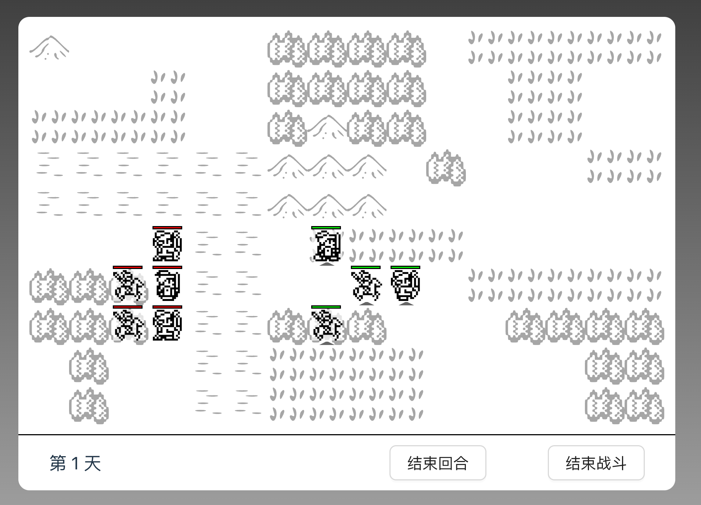

# Battle Chess

使用 JavaScript 开发的三国背景战棋类策略游戏。

在线地址：https://battle-chess.vercel.app

（开发中……）

## TODO

- [x] 加入弓兵图标
- [x] 加入弓兵攻击范围判断
- [x] 加入骑兵图标
- [x] 区分敌我棋子
- [x] 加入步兵图标
- [x] 加入胜利与失败的结算消息
- [x] 敌方可移动
- [x] 敌方会随机挑选目标
- [ ] 敌方回合时玩家无法操作棋子
- [ ] 敌我回合切换时显示回合信息
- [x] 攻击 logo 不应该显示在自己身上
- [x] 伤害公式
- [x] 兵种加成
- [ ] 兵种间克制
- [x] 地形对防御加成
- [x] 加入取消菜单
- [ ] 加入武将技能
- [x] 加入武将和地形信息说明
- [x] 修改造成伤害的显示格式
- [ ] 地图编辑器
- [x] 加入水军兵种
- [x] 位于河流地形时展示不同图标
- [ ] 加入城池地形
- [x] 加入行动力设定
- [ ] 加入地形的说明描述
- [ ] 加入武将头像
